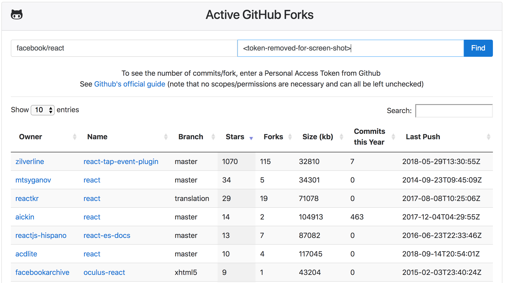

Active-Forks
===========

Sort project forks by stars, last update, annual commits, etc.



# Quick Start

Currently, this tool isn't hosted online but can be run locally. Clone the repository, then open the index.html file in Chrome.

```
git clone https://github.com/KyleKing/active-forks.git
open active-forks/index.html
```
